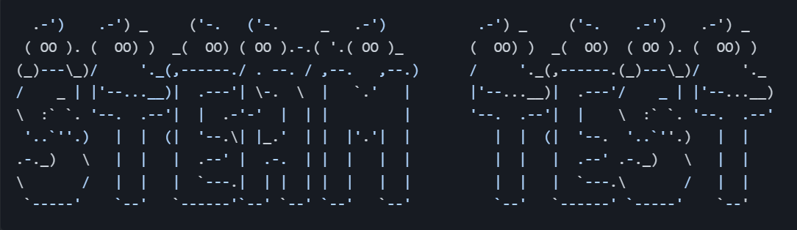
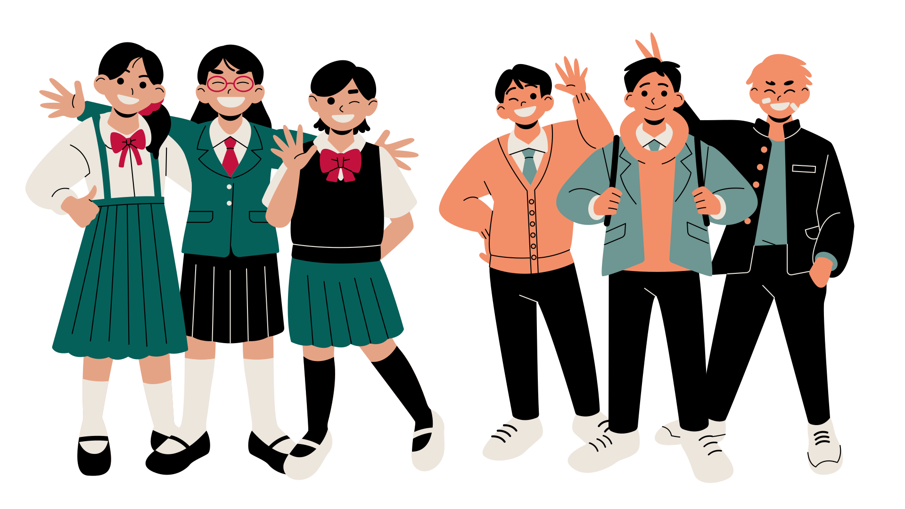

<div align="center">

  




# Steam Test: a fun cross-curricular quiz for students <!-- omit in toc -->

</div>

<div align=center></div><br>

This readme introduces the key features of the project, using the framework of the 5 planes of User Experience. It summarises key challenges addressed along the way and also provides credits and acknowledgesments at the end.

An [issues.md](https://github.com/lmcrean/Crocodile-Kingdom/blob/main/issues.md) file is dedicated to the most specific technical account of important issues and bugs that were researched and solved during the project.

<div align=center>

***Navigation Links:***

</div>

## Table of Contents: <!-- omit in toc -->

<b>

[1. Outline of Features](#1-outline-of-features)<br>
[2. Manual Testing with the UX Development Planes](#2-ux-development-planes--manual-testing)<br>
[3. Automatic Testing & Deployment](#3-automatic-testing--deployment)<br>
[4. Issues and Bugs](#5-issues-and-bugs)<br>
[5. Credits & Acknowledgements](#6-credits--acknowledgements)

</br>
</b>

***

Full Table of Contents: <!-- omit in toc --></div>

- [1. Outline of Features](#1-outline-of-features)
  - [1.1. Feature 1](#11-feature-1)
- [2. Manual Testing with the UX Development Planes](#2-manual-testing-with-the-ux-development-planes)
  - [2.1. Strategy Plane](#21-strategy-plane)
    - [2.1.1. Developer Research](#211-developer-research)
    - [2.1.2. Initial Product Research](#212-initial-product-research)
    - [2.1.3. Project Timeline](#213-project-timeline)
    - [2.1.4. User Stories \& business goals](#214-user-stories--business-goals)
  - [2.2. Scope plane](#22-scope-plane)
    - [2.2.2. Mininum Viable Product features](#222-mininum-viable-product-features)
    - [2.2.3. Unique Selling Point features](#223-unique-selling-point-features)
    - [2.2.4. Scope of Features](#224-scope-of-features)
  - [2.3. Structure Plane](#23-structure-plane)
  - [2.4. Skeleton Plane](#24-skeleton-plane)
  - [2.5. Surface Plane](#25-surface-plane)
- [3. Automatic Testing \& Deployment](#3-automatic-testing--deployment)
  - [3.1. Validator Testing](#31-validator-testing)
  - [3.2. Lighthouse Report](#32-lighthouse-report)
  - [3.3. Browserstack Testing](#33-browserstack-testing)
  - [3.4. Deployment](#34-deployment)
- [4. Issues and Bugs](#4-issues-and-bugs)
- [5. Credits \& Acknowledgements](#5-credits--acknowledgements)
  - [5.1. Initial Resources Research](#51-initial-resources-research)
  - [5.2. Code snippets](#52-code-snippets)
  - [5.3. Technologies Used](#53-technologies-used)
  - [5.4. Libraries Used](#54-libraries-used)
  - [5.5. Acknowledgements](#55-acknowledgements)

<div align=center></div>
<div align="center">

# 1. Outline of Features

## 1.1. Feature 1
<a src="assets/media/issues/1.1.5.mp4"></a></div>


<div align=center>


# 2. Manual Testing with the UX Development Planes

</div>

**The 5 UX development planes were used as an efficient framework for documenting the project's intentions.** 


**Manual testing focused on the functionality of the JS logic and CSS visuals:**

Using the latter 3 UX Planes as a guideline:
- **For the Structure plane, JS logic and HTML hyperlinks** functionality within each feature, using console.log() to check that the code was running as expected.
- **For the Skeleton plane, CSS positioning and responsivity to viewport width**, key breakpoints being at mobile view, tablet view (768px), laptop view (1208px) and desktop view (1728px+). 
- **For the Surface plane, design choices through vector graphics, typography, color and sound** that serve the user stories and elicit a positive emotional response. CSS was the key programming language and Canva was used for rendering graphic illustrations.

<div align=center>

## 2.1. Strategy Plane

The Strategy plane set the intention of $$$$$$$$$$$$$$$$$$$$$$$$ that would be developed over 5 weeks.

</div>


### 2.1.1. Developer Research

[↑ Back to top](#Portfolio-Project-2-with-Javascript)

***

### 2.1.2. Initial Product Research
Initial Product research is credited in the [Credits and Acknowledgements section](#5-credits--acknowledgements).

[↑ Back to top](#Portfolio-Project-2-with-Javascript)

***

### 2.1.3. Project Timeline

The 6 week timeline used the Agile method of interations and priorities. Todoist was chosen as the project management tool for it's simplicity and efficiency.

$$$$$$$$$$$$$$$$$$$$$$$$$$$$$$$$$$screen shot of todoist 

[↑ Back to top](#Portfolio-Project-2-with-Javascript)

***

### 2.1.4. User Stories & business goals

The business goals were xxxxxxxxxxxxxxxxxxxxxxxxxxxxxxxx

<div align="center"><h3> User Stories testing</h3>


 </div>

**Business stories**
I need to promote Careers in STEAM

I need CRUD logic

I need footers at the bottom

User stories

**Scope**
I need a quiz that tests me on STEAM subjects

I need to check my high score

I want option to update my high score and username

I want to be able to delete my high score

**Structure**
I need all the controls to navigate the quiz successfully

I need the quiz to show me my overall high score and assess my high score on individual sections.

I need to see my rank in the leaderboard. (If I completed the quiz faster than a user of the same rank, I deserve to be a higher rank)

I need each section to select 10 random MCQs from a large database

I need a time limit of 5 minutes for each section

**Skeleton needs**
I need to see the logo consistently throughout the game

I need to track my high score throughout the game

I need the all the text to fit in the 80 by 80 box

**Surface needs**
I would like to see a ASCII decorated logo

I would like to have my terminal centered with a background


<div align=center></div>

## 2.2. Scope plane

It was important to choose a project that was achievable in the time frame, and that had a lot of resources available.

The project was researched, conceived and designed in 6 weeks. Important limitations of the project had to be set from the outset such as
- **Developing the Mininum Viable Product and Unique Selling Point simultaeneously.** This way, the essential product would be met in time with the deadline, and the unique features would keep me motivated.

[↑ Back to top](#Portfolio-Project-2-with-Javascript)

<div align=center></div>

### 2.2.2. Mininum Viable Product features

A mininum viable product is a product with just enough features to satisfy early customers, and to provide feedback for future development.

<i>
The minumum viable product was

- a navigation menu with START, HIGH SCORES and HOW TO PLAY
- a quiz with 10 questions per section
- 5 sections of questions on Science, Technology, Engineering, Arts and Mathematics
- a high score with a username, score, timestamp and rank. 
- option to restart the quiz
</i>

***


### 2.2.3. Unique Selling Point features

The unique selling point features were designed to meet the needs of new players, and to make the game more engaging and fun.

<i>
- consistent header display in terminal
- if players have the same rank, the player who completed the quiz faster will be ranked higher
- incorperation of extension challenges e.g. unique games
- ASCII header
- custom feedback for each section
</i>

[↑ Back to top](#Portfolio-Project-2-with-Javascript)

***

### 2.2.4. Scope of Features

The full scope and function of features is discussed in the opening [Features](#1-features) section.

[↑ Back to top](#Portfolio-Project-2-with-Javascript)

<div align=center></div>

## 2.3. Structure Plane

This Structure plane summarises the structure of each feature by highlighting most essential HTML, CSS and JS functions for the feature to work. The developer also used this as a workflow for drafting in the features.

***

[↑ Back to top](#Portfolio-Project-2-with-Javascript)

<div align=center></div>

## 2.4. Skeleton Plane

The skeleton plane covers the layout of the website, and the responsiveness to viewport width.

[↑ Back to top](#Portfolio-Project-2-with-Javascript)

<div align=center></div>

## 2.5. Surface Plane
This surface plane describes the choice of typefaces, colors and style themes relevant to the project's desired tone and practical needs.

[↑ Back to top](#Portfolio-Project-2-with-Javascript)

<div align=center>

# 3. Automatic Testing & Deployment


</div>

The Automatic Testing achieved
- xxxxxxxxxxxxxxx
- xxxxxxxxxxxxx
- xxxx

[↑ Back to top](#Portfolio-Project-2-with-Javascript)

***

## 3.1. Validator Testing


[↑ Back to top](#Portfolio-Project-2-with-Javascript)


***

## 3.2. Lighthouse Report

To check the lighthouse report on a chrome browser, right click inspect and click on the lighthouse tab.

| | Home Page |
|---|---|
| Mobile | .png)  | 
| Desktop | .png)| 
|Timestamp| 9/9/2023 |

[↑ Back to top](#Portfolio-Project-2-with-Javascript)


***

## 3.3. Browserstack Testing

https://www.browserstack.com/

xxxxxxxxxxxxxxxx

[↑ Back to top](#Portfolio-Project-2-with-Javascript)

<div align=center>

## 3.4. Deployment

</div> 

The project was deployed on Heroku. The following steps were taken:

1. Create a new app on Heroku
2. Add the following buildpacks in the following order:
    1. heroku/python
    2. heroku/nodejs
3. Connect the app to the Github repository
4. Deploy the app


[↑ Back to top](#Portfolio-Project-2-with-Javascript)

<div align=center>

# 4. Issues and Bugs


</div>

***

They can be summarised here:


[↑ Back to top](#Portfolio-Project-2-with-Javascript)

<div align=center>


# 5. Credits & Acknowledgements

</div>

## 5.1. Initial Resources Research

In early stages of development, the following python projects were tested and researched to gain an understanding of Python and find inspiration for an original project.

<details><summary><b> click here to view initial research and inspiration </b></summary>
<br><br>

**Python Projects:**
- “Tomdu3/Millionaire-Kindof: CI Project 3 - Who Wants to Be a Millionaire. Kind Of.” GitHub, 18 Mar. 2023, github.com/tomdu3/millionaire-kindof. Accessed 17 Sept. 2023.
  - username with validation check
  - decorated with title displays constantly, ASCII art, fast animations
  - navigation menu including how to play, high scores
  - points guaranteed constantly displays and updates
  - connects to a Google Sheet and updates the high scores
  - uses the Trivia API “The Trivia API | the Internet’s Largest Database of Multiple Choice Quiz Questions.” The-Trivia-Api.com, 2023, the-trivia-api.com/. Accessed 17 Sept. 2023.

- “Rockroman/PP3_The_Coach.” GitHub, 7 Oct. 2022, github.com/rockroman/PP3_The_Coach. Accessed 17 Sept. 2023.
  - presents data as a table after collecting user data
  - calculates a % score based on data

- “Beratzorlu/Python-Quiz: Code Institute Prof. Dip. Full Stack Software Development Portfolio Project 3: A CLI-Based Quiz Game.” GitHub, 2023, github.com/beratzorlu/python-quiz. Accessed 17 Sept. 2023.
  - quiz logic with validation check and a database
  - score logic
  - science question
  - user name with validation check
  - decorated with colors and ASCII art

- “Alexkisielewicz/Home-Library-App: Home Library App Was Created as Portfolio Project #3 (Python Essentials) for Diploma in Full Stack Software Development at Code Institute.” GitHub, 20 Nov. 2022, github.com/alexkisielewicz/home-library-app. Accessed 17 Sept. 2023.
  - advanced CRUD logic 
  - displays tables
  - changes sorting method

- “Jkingportfolio/CI_PP3_Taco_Trailer: Code Institute Full Stack Developer Course - Portfolio Project 3 - Python Essentials.” GitHub, 15 Sept. 2022, github.com/jkingportfolio/CI_PP3_Taco_Trailer. Accessed 17 Sept. 2023.

**Walkthroughs:**
- “Code-Institute-Solutions/Love-Sandwiches-P5-Sourcecode.” GitHub, 25 Mar. 2021, github.com/Code-Institute-Solutions/love-sandwiches-p5-sourcecode. Accessed 17 Sept. 2023. 
  - Shows how to connect to a Google Sheet
  - Creates a formula for calculating the data on different sheets
  - Shows how to deny invalid input
  - How to structure code with Main() function and other functions
  - Experimented with the code to see how python could recognise the data in the Google Sheet, regardless of whether it was a calculated formula or not.
  
  <details><summary>Tested some basic CSS decorations, click here to view</summary>
  
  ```css
    body {
    background-image: url(https://i.ibb.co/fSD71Nb/endless-constellation.png);/*Todo: try hosting the image locally on github*/
    background-size: 300px;
    background-repeat: repeat;
    background-attachment: fixed;
    display: flex;
    justify-content: center;
    align-items: center;
    flex-direction: column;
    height: 100vh;
    }
  ```

  </details>
- Run That. “Quiz App Using API Data - Python Project 💥 Make a Python Quiz App.” YouTube, YouTube Video, 16 May 2023, www.youtube.com/watch?v=kW2f1Hwgals. Accessed 17 Sept. 2023.
  - how to use OpenTriviaDB API

**Python Libraries**

- “Prettytable.” PyPI, 11 Sept. 2023, pypi.org/project/prettytable/. Accessed 21 Sept. 2023.
- “Colorama.” PyPI, 25 Oct. 2022, pypi.org/project/colorama/. Accessed 21 Sept. 2023.

‌
**Automatic Testing Resources**
- “CI Python Linter.” Herokuapp.com, 2023, pep8ci.herokuapp.com/. Accessed 21 Sept. 2023.

**Databases**
- “Open Trivia DB.” Opentdb.com, 2023, opentdb.com/. Accessed 17 Sept. 2023.
  - this is the API used in the walkthrough above
  - it has a lot of categories and questions
- “The Trivia API | the Internet’s Largest Database of Multiple Choice Quiz Questions.” The-Trivia-Api.com, 2023, the-trivia-api.com/. Accessed 17 Sept. 2023.
- Personal Marksheet Database. Accessed 21 Sept 2023.
  - this is a database that I created at a previous school to calculate student data. The feedback updates according to the data entered, assuming and identifying the most urgent areas to improve.
  - The subject matter of an Art Test is a little problematic undermines cultural enrichment aspect of the subject. 
  - Contains "Free School Meals", Special Needs and English as an Additional Language Data which is useful.
  - Could it be resummarised as a more objective test?
  - Could it be an essential prompt that the success criteria is defined by the user with 6 criteria? Then use the existing data as dummy data. Then allow the user to create their own data.


**Surface Design**
- “Create ASCII Text Banners Online.” Manytools.org - Your Online Toolshed, 2022, manytools.org/hacker-tools/ascii-banner/. Accessed 17 Sept. 2023.

**Other**
- nevsky.programming. “Top 5 Most Useful Python Libraries #Shorts.” YouTube, YouTube Video, 29 July 2021, www.youtube.com/shorts/1hFq8EdQpqM. Accessed 21 Sept. 2023.
- “Code Institute Curriculum.” Codeinstitute.net, 2023, learn.codeinstitute.net/ci_program/diplomainfullstacksoftwarecommoncurriculum. Accessed 21 Sept. 2023. Available to students only.

‌

‌</details>

## 5.2. Code snippets


[↑ Back to top](#Portfolio-Project-2-with-Javascript)


## 5.3. Technologies Used

**Languages**
- [Python](https://www.python.org/) was used as the backend programming language

**Programming Software**
- [VSCode](https://code.visualstudio.com/) was used as my code editor
- [Gitpod](https://www.gitpod.io/) was used as my secondary code editor
- [Github](https://www.github.com/) was used for Version control

**General Software**


**Tools**


[↑ Back to top](#Portfolio-Project-2-with-Javascript)

***

## 5.4. Libraries Used

**Programming Libraries**


**Media libraries**

**Fonts**


***


‌

‌


## 5.5. Acknowledgements


[↑ Back to top](#Portfolio-Project-2-with-Javascript)

<div align=center><br><br></div>

</div>
